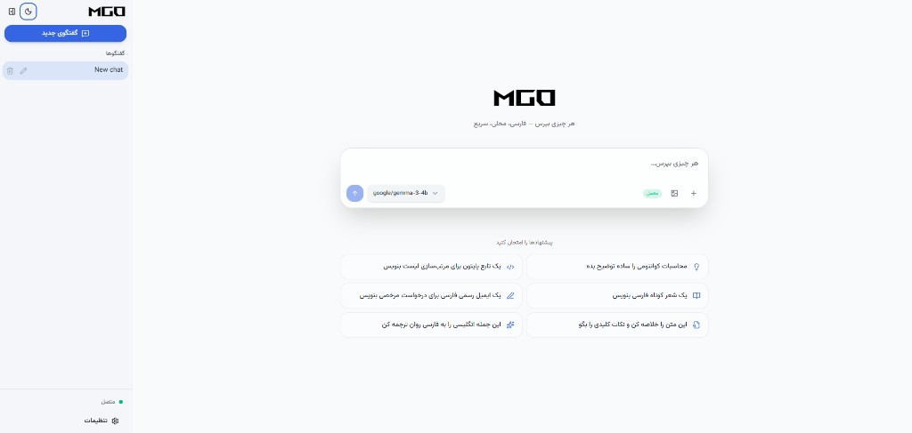

# MGo

A modern, bilingual chat interface for **local LLMs** powered by [LM Studio](https://lmstudio.ai/). Built with **Tauri 2** and **React 19**, MGo delivers a polished desktop and browser experience with first-class **Persian (RTL)** and **English** support.




---

## Overview

MGo is a client-side chat application — not an inference engine. It connects to a running **LM Studio** server over the OpenAI-compatible API (`/v1/models`, `/v1/chat/completions`) and provides:

- A clean, responsive chat UI with streaming responses
- Multiple conversations stored locally on your machine
- Persian-first layout (RTL, Vazirmatn font, localized prompts)
- Optional desktop packaging via Tauri 2 (Windows, macOS, Linux)
- A fast browser dev workflow with a built-in CORS proxy

All inference runs locally through LM Studio. MGo never sends your chats to a cloud API unless you explicitly point it at a remote endpoint.

---

## Features

### Chat & LM Studio

- **OpenAI-compatible API** — Works with LM Studio’s local server (`http://127.0.0.1:1234/v1` by default)
- **Streaming responses** — Token-by-token output with a stop button during generation
- **Multiple conversations** — Create, rename, delete, and switch between chats; each chat remembers its model
- **Smart model picker** — Embedding models are filtered out; only chat-capable models appear
- **Human-readable model names** — Raw IDs like `google/gemma-3-4b-it` are shown as **Gemma 3** in the UI
- **Vision support** — Attach images for multimodal models; text files (`.txt`, `.md`, `.json`) are inlined as context
- **Attachments** — Drag-and-drop, paste, or file picker; images up to 8 MB, text files up to 2 MB
- **Suggestion prompts** — Quick-start chips on an empty chat (explain, code, write, summarize, translate, …)
- **Markdown rendering** — GitHub Flavored Markdown, syntax-highlighted code blocks (LTR inside RTL replies)
- **Connection status** — Live indicator in the sidebar; automatic reconnect check on startup

### Persian & bilingual UX

- **RTL-first design** — Sidebar placement, settings panel slide direction, and document `dir`/`lang` follow locale
- **Persian (fa) and English (en)** — Full UI translation via `react-i18next`
- **Localized defaults** — Persian system prompt templates when locale is `fa`
- **Vazirmatn typeface** — Loaded for Persian text; monospace for code and version strings

### Appearance

- **Dark & light themes** — Toggle in the sidebar or collapsed sidebar rail; persisted automatically
- **Six color palettes** — MGo (default), Ocean, Violet, Rose, Forest, Ember — chosen from a bottom sheet in the sidebar header
- **Glassmorphic version badge** — Fixed bottom-right pill showing `MGo | v0.1.0`
- **Rounded UI** — Buttons and controls use consistent pill/rounded styling
- **Responsive layout** — Desktop sidebar + mobile drawer with overlay; safe-area aware on small screens

### Settings

Slide-over panel (opens from the **right** in Persian, **left** in English):

| Section | Options |
|---------|---------|
| **Connection** | Base URL, optional API key, test connection |
| **Model** | Default model, custom system prompt |
| **Inference** | Temperature (0–2), max tokens (256–8192), top-p (0–1) |
| **Appearance** | Language, light/dark theme |

Settings auto-save to `localStorage` (browser) or Tauri plugin-store (desktop).

### In-app updates

On startup, MGo checks your Git clone against `origin/main` on GitHub:

- If a newer commit or version is available, the **version badge** expands inline: `آپدیت جدید` / **New update** + download icon
- One click runs `git pull origin main` (via Vite dev middleware in browser mode, or Tauri Git commands on desktop)
- After a successful pull, the badge closes smoothly; dismiss with ✕ to skip until the next commit SHA
- **Requires a git clone** — ZIP downloads have no `.git` folder and cannot pull updates

Configure the repo in `.env`:

```env
VITE_GITHUB_REPO=your-username/mgo
```

Bump `version` in `package.json` before pushing so the update check can compare semver.

---

## Tech Stack

| Layer | Technologies |
|--------|----------------|
| Desktop shell | [Tauri 2](https://v2.tauri.app/), Rust |
| Frontend | React 19, TypeScript, Vite 7 |
| Styling | Tailwind CSS v4, CSS custom properties (palettes), Radix UI |
| State | Zustand |
| i18n | i18next, react-i18next |
| Markdown | react-markdown, remark-gfm, rehype-highlight |
| Icons | lucide-react |
| Persistence | `localStorage` (browser) / `@tauri-apps/plugin-store` (desktop) |
| Updates | Git fetch + semver compare; Tauri `git_update` module on desktop |

---

## Prerequisites

### All platforms

- [Node.js](https://nodejs.org/) **20+**
- [LM Studio](https://lmstudio.ai/) with **Developer → Start Server** enabled (default: `http://127.0.0.1:1234`)

### Desktop build (Tauri)

- [Rust](https://rustup.rs/) (latest stable)
- **Windows:** [Visual Studio Build Tools](https://visualstudio.microsoft.com/visual-cpp-build-tools/) with **Desktop development with C++**
- **macOS:** Xcode Command Line Tools
- **Linux:** See [Tauri prerequisites](https://v2.tauri.app/start/prerequisites/)

---

## Quick Start

### 1. Clone and install

> **Important:** Clone with `git clone`, not the GitHub ZIP. In-app updates need a `.git` directory.

```bash
git clone https://github.com/YOUR_USERNAME/mgo.git
cd mgo
npm install
```

Optional `.env`:

```env
VITE_GITHUB_REPO=your-username/mgo
```

### 2. Start LM Studio

1. Open LM Studio and load a chat model.
2. Go to **Developer → Start Server**.
3. Confirm the URL (default): `http://127.0.0.1:1234`

### 3. Run in the browser (recommended for development)

```bash
npm run mgo
```

Open [http://localhost:1420](http://localhost:1420).

API calls to local LM Studio are proxied through `/api/lmstudio` to avoid browser CORS restrictions.

### One-click launch

| Platform | Action |
|----------|--------|
| **Windows** | Double-click [`start-mgo.bat`](start-mgo.bat) |
| **Linux / macOS** | `chmod +x start-mgo.sh && ./start-mgo.sh` |

These scripts:

1. Run `npm install` if `node_modules` is missing
2. Start the Vite dev server (`npm run mgo`)
3. Wait until port `1420` responds
4. Open the browser automatically

Optional config: copy [`start-mgo.dat.example`](start-mgo.dat.example) to `start-mgo.dat` and edit `MGO_DIR`, `PORT`, or `OPEN_BROWSER`.

On Windows, Vite runs in a separate terminal window (`mgo-dev-server.cmd`) — keep it open while using MGo.

### 4. Run as a desktop app

```bash
npm run tauri dev
```

Tauri starts the Vite dev server internally and opens a native window.

---

## Build

### Web (static assets)

```bash
npm run build
npm run preview   # optional: serve dist/ locally
```

Output: `dist/`

### Desktop installer

```bash
npm run tauri build
```

Installers are generated under:

```
src-tauri/target/release/bundle/
```

Examples: `.msi` / `.exe` (Windows), `.dmg` (macOS), `.AppImage` / `.deb` (Linux)

---

## Configuration reference

| Setting | Default | Description |
|---------|---------|-------------|
| **Base URL** | `http://127.0.0.1:1234/v1` | LM Studio OpenAI-compatible endpoint |
| **API Key** | *(empty)* | Optional; leave blank for local LM Studio |
| **Default model** | — | Set after a successful connection test |
| **System prompt** | *(locale default)* | Prepended to every conversation |
| **Temperature** | `0.7` | Randomness (0 = deterministic, 2 = very creative) |
| **Max tokens** | `2048` | Upper bound on assistant reply length |
| **Top P** | `0.95` | Nucleus sampling |
| **Language** | Persian (`fa`) | UI language and document direction |
| **Theme** | Dark | Light or dark mode |
| **Color palette** | MGo | One of six accent themes |

Storage keys (browser): `mgo:settings`, `mgo:conversations`, `mgo:ui`, `mgo:update:dismissed-sha`

---

## Project structure

```
mgo/
├── src/
│   ├── app/                    # App shell (AppLayout)
│   ├── assets/                 # Logos and favicons
│   ├── components/             # Shared UI (Logo, ThemeToggle, AppVersionBadge, …)
│   │   └── ui/                 # shadcn-style primitives (button, dialog, sheet, …)
│   ├── features/
│   │   ├── appearance/         # PaletteSheet (color theme picker)
│   │   ├── chat/               # ChatArea, ChatHeader, ChatInput, MessageBubble
│   │   ├── conversations/      # Sidebar, conversation list
│   │   └── settings/           # SettingsPanel (slide-over)
│   ├── hooks/                  # useMediaQuery (mobile breakpoint)
│   ├── lib/
│   │   ├── lmstudio/           # API client, SSE streaming, model filters, URL resolver
│   │   ├── i18n/               # Locales (fa.json, en.json)
│   │   ├── update/             # GitHub update check, semver helpers
│   │   ├── modelDisplayName.ts # Human-readable model labels
│   │   ├── palettes.ts         # Palette definitions
│   │   ├── attachments.ts      # File/image attachment handling
│   │   ├── persist.ts          # Storage abstraction
│   │   └── persian.ts          # RTL prompts and text helpers
│   ├── stores/                 # Zustand (settings, chat, conversations, ui, update)
│   └── styles/
│       └── palettes.css        # CSS variables per palette
├── src-tauri/                  # Tauri 2 Rust backend (git update commands)
├── public/                     # Static assets
├── start-mgo.bat / .sh         # One-click launchers
├── mgo-dev-server.cmd          # Windows Vite wrapper (do not close banner)
├── vite.config.ts              # Dev server, LM Studio proxy, update API plugin
├── vite-plugin-mgo-update.ts   # Dev-server git pull endpoint
└── vite-plugin-ts-mime.ts      # Serves .ts as text/javascript (IDM-safe)
```

---

## How it works

### Data flow

```
Browser / Tauri WebView
        │
        ▼
   MGo React UI  ──►  Zustand stores  ──►  localStorage / Tauri store
        │
        ▼
  LM Studio client (fetch + SSE)
        │
        ├── Dev:  /api/lmstudio/v1  ──►  Vite proxy  ──►  127.0.0.1:1234/v1
        └── Desktop prod:  direct to configured baseUrl
```

### CORS in the browser

Browsers block `localhost:1420 → 127.0.0.1:1234`. In development, `resolveApiBase()` routes local URLs through:

```
/api/lmstudio/v1 → http://127.0.0.1:1234/v1
```

Production Tauri builds call LM Studio directly (no CORS in the webview).

### Streaming & scroll

While the model streams, MGo does **not** force-scroll. You can read earlier messages freely. Auto-follow resumes when you scroll near the bottom (~80 px) or send a new message.

### Model display names

LM Studio returns verbose model IDs (publisher, size, variant). MGo parses known families (Gemma, GPT, Llama, Mistral, Qwen, …) and shows a short **brand + version** label in selectors, keeping the full ID available as a tooltip.

### Layout by locale

| Locale | Sidebar | Settings panel |
|--------|---------|----------------|
| **fa** (RTL) | Left | Slides from right |
| **en** (LTR) | Right | Slides from left |

Code blocks and API URLs always render LTR.

---

## Scripts

| Command | Description |
|---------|-------------|
| `npm run mgo` | Start Vite dev server on port `1420` |
| `npm run build` | Type-check (`tsc`) and build frontend to `dist/` |
| `npm run preview` | Preview production build |
| `npm run tauri dev` | Run Tauri app in development |
| `npm run tauri build` | Build desktop installers |

---

## Troubleshooting

| Issue | Solution |
|-------|----------|
| **Connection failed** | Ensure LM Studio server is running; Base URL must end with `/v1` |
| **`link.exe` not found** (Windows) | Install Visual Studio C++ Build Tools |
| **Port 1420 in use** | Stop other dev servers or change port in `vite.config.ts` |
| **No models in dropdown** | Click **Test connection** in Settings; load a chat model in LM Studio |
| **Black / loading screen** | Hard refresh; clear `localStorage` keys prefixed with `mgo:` |
| **Update button does nothing** | Clone with git, not ZIP; set `VITE_GITHUB_REPO` in `.env` |
| **IDM intercepts `.ts` files** | Handled by `vite-plugin-ts-mime.ts` in dev; use `npm run mgo` |
| **Image attachment rejected** | Max 8 MB per image; model must support vision |

---

## Contributing

Contributions are welcome. Please open an issue or pull request with a clear description.

1. Fork the repository
2. Create a feature branch (`git checkout -b feature/my-change`)
3. Commit your changes
4. Push and open a PR

---

## License

This project is licensed under the [MIT License](LICENSE).

---

## Acknowledgments

- [LM Studio](https://lmstudio.ai/) — local LLM inference
- [Tauri](https://v2.tauri.app/) — cross-platform desktop shell
- [Vazirmatn](https://github.com/rastikerdar/vazirmatn) — Persian typeface
- [Radix UI](https://www.radix-ui.com/) — accessible component primitives
